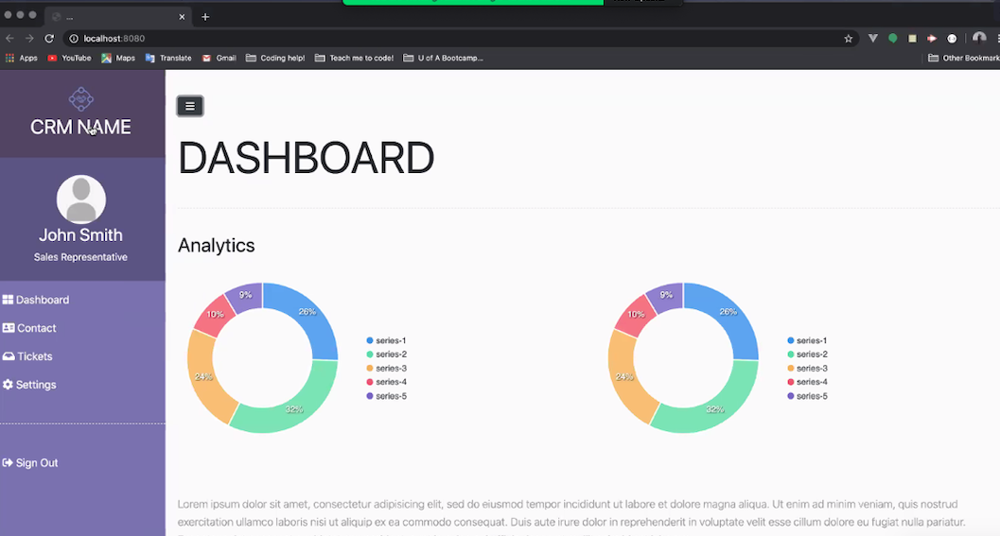

# Impact X 
created by: Hisham Saymeh, Michael Stoddard, Niasha Abaglo-Grant, Steffi Wellington

### Overview
This CRM system has an Impactful eXperience for support technicians as it is intuitive with dashboard analytics, easy to use settings, ticketing system with unique  customers calling system accomplished within the CRM, and contact management page to manage internal as well as external contacts specific to the individual user. 

### Link to Live Impact X CRM -- https://impactx-crm.herokuapp.com/

### Motivations

    * An effective system to keep track of customers and stay on top of day to day business.
    * Call customers in the browser. 
    * Dashboard of analytics for user insights.

### Resources

    * HTML, CSS, Javascript, Node.js
    * Bcrypt, Passport, Session
    * Express, Handlebars, 
    * Multer, Twilio
    * Sequelize, MySQL, Amazon S3

### Contributions 
   #### Hisham:
    * Authentication
    * Twilio Integration
    * Amazon S3 Database
    
   #### Michael:
    * Logo/Title Creation
    * Login/Admin Pages
    * Contacts Page
    
   #### Niasha:
    * Navbar/Settings
    * Tickets
    * Dashboard
   
   #### Steffi:
    * MySQL Database
    * Deployment
    * API Routes

*Click the image below and log into Impact x with the following credentials.
   *Username: guest 
   *Password: 0123

